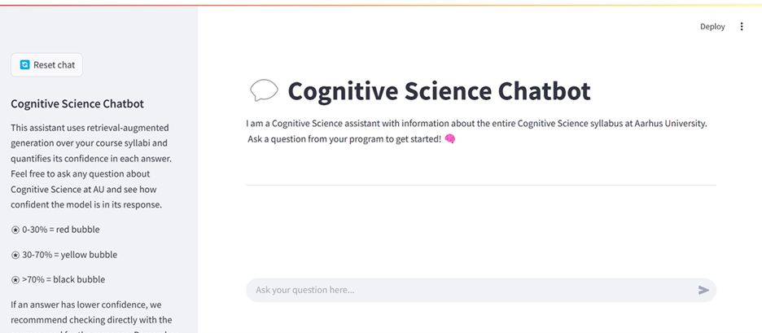

<!-- template adapted from: https://github.com/othneildrew/Best-README-Template -->
<!-- Improved compatibility of back to top link: See: https://github.com/othneildrew/Best-README-Template/pull/73 -->
<a id="readme-top"></a>

<!-- PROJECT SHIELDS -->
<!--
*** I'm using markdown "reference style" links for readability.
*** Reference links are enclosed in brackets [ ] instead of parentheses ( ).
*** See the bottom of this document for the declaration of the reference variables
*** for contributors-url, forks-url, etc. This is an optional, concise syntax you may use.
*** https://www.markdownguide.org/basic-syntax/#reference-style-links
-->
[![project_license][license-shield]][license-url]
[![LinkedIn][linkedin-shield]][linkedin-url]


# The Cognitive Science Chatbot, a *trustworthy* RAG demo 🤖🧠 
This repository contains a prototype implementation of a Retrieval‑Augmented Generation (RAG) chatbot with uncertainty estimation and sources for each response. The codebase is structured as a proper Python package (internal) and a Streamlit front‑end app interface. 
The product was developed and designed as part of my thesis at Cognitive Science, Aarhus University. 

<!-- TABLE OF CONTENTS -->
<details open>
  <summary>Table of Contents</summary>
  <ol>
    <li>
      <a href="#about-the-project">About The Project</a>
        <ul>
        <li><a href="#features">Features</a></li>
      </ul>
    </li>
    <li>
      <a href="#getting-started">Getting Started</a>
      <ul>
        <li><a href="#prerequisites">Prerequisites</a></li>
        <li><a href="#installation">Installation</a></li>
      </ul>
    </li>
    <li><a href="#usage">Usage</a></li>
    <li><a href="#license">License</a></li>
    <li><a href="#contact">Contact</a></li>
  </ol>
</details>

<!-- ABOUT THE PROJECT -->
## 📚 About The Project 
- pipeline image here

[![Product Name Screen Shot][product-screenshot]](https://example.com)

The project here has a two-fold purpose. Firstly, it contains a quick-start way to run the Cognitive Science chatbot with all necessary pre and post-processing supplied in a separate file. Secondly, it contains all code to reproduce the steps taken as part of the Thesis project. Additionally, the repository is constructed in a modular way, to allow the same code to work with a different raw dataset, adding another uncertainty estimation method, a different retriever or more!

### 🌟 Features 
- **Hybrid Retrieval (BM25 + dense)** with cross‑encoder re‑ranking  
- **Uncertainty Quantification** (Lexical Similarity, Degree Matrix NLI, Eccentricity)
- **Streamlit UI** with provider settings & parameter sliders 
- **Confidence Calibration** → red / yellow / black chat bubbles
- **LLM-based test-set generation** using the **Ragas** framework
- **Fast dependency resolution** via **uv**  
- Modular, testable pipeline (data → embeddings → retriever → generator)


<!-- GETTING STARTED -->
## 🛠️ Getting Started 

To get a local copy of this product up and running follow the steps in this section first.

### 💻 Prerequisites 

* Python ≥ 3.12
* Install the [uv](https://github.com/astral-sh/uv) package manager.
Select the correct installer for your environment from the examples below
  ```sh
  # On macOS and Linux.
  curl -LsSf https://astral.sh/uv/install.sh | sh
  ```
  ```sh
  # On Windows.
  powershell -ExecutionPolicy ByPass -c "irm https://astral.sh/uv/install.ps1 | iex"
  ```
  ```sh
  # With pip.
  pip install uv
  ```
* You need API provider access from UCloud __*or*__ Huggingface.
  * Setup a GPU powered ChatUI app on UCloud. Follow the guide written out below. See more at [ChatUI documentation](https://docs.cloud.sdu.dk/Apps/chat-ui.html)
  * A Huggingface API key. Follow this guide to setup a [user access token](https://huggingface.co/docs/hub/security-tokens)
* You need the full contents of the *data* and *output* folder at hand. These are attached to the thesis hand-in and must be dropped in place in the corresponding location of this repository.
* *Optional* - To re-run the Ragas testset generation, you need an [OpenAI API key](https://platform.openai.com/docs/api-reference/introduction). Note that nearly all of the API calls are stored in the Ragas cache shared with you in the data folder.

### 💻 Installation

1. Clone the repository
   ```sh
   git clone https://github.com/SarahHvidAndersen/Thesis-Trustworthy-RAG.git
   cd Thesis-Trustworthy-RAG
   ```
2. Create the uv env
   ```sh
   # on macOS and Linux.
   uv venv .venv
   ```
   ```sh
   # on Windows
   .venv\Scripts\Activate
   ```
3. Activate the new env
   ```sh
   source .venv/bin/activate 
   ```
4. Synchronize locked dependencies
   ```sh
   uv sync
   ```
<p align="right">(<a href="#readme-top">back to top</a>)</p>

## 🤖 Usage 
The chatbot developed here can be used to interact with the entire Cognitive Science syllabus at Aarhus university. It was created to be more trustworthy than other bots by grounding its knowledge with a RAG database, supplying the user with uncertainty estimation scores, and providing the exact sources retrieved from the syllabus based on the users query. These steps provide more transparency during chatbot interactions and supports development of AI literacy among students.

![Chatbot Startpage Screen Shot][startup-screenshot]



### 🚀 Quick Start 
After following the installation guide, you can follow these steps to see the chatbot in action first!

1. Drop-in the *data* and *output* folders
2. Launch ChatUI or setup Huggingface
3. Launch the chatbot interface:
  ```python
   streamlit run src/rag_chatbot/streamlit_app.py
   ```
4. Input you provider API key in the Provider settings and start chatting!

### Re-running all pipelines
The codebase is modular. If you wish to swap out any element such as the database itself or the retriever you can!
The following passage however, will assume access to the raw data from the Cognitive Science Syllabus, that was gathered as part of this thesis. It will also assume some background knowledge provided in the accompanying thesis paper, to not go into depth with explanations of *why* decisions were made, but rather focus on *how* to reproduce all original results.
With the raw data folder in place, all pipelines can be re-fitted. __Note__ that all scripts should be run with uv and as a module, to utilize the absolute import paths. 
Additionally, the computation of embeddings is time-consuming on a cpu, so the script checks whether these files are already present in the *processed_syllabi* folder. 
To re-run completely from scratch, make sure to delete this folder first.

1. Run the *course_pipeline.py* 
  ```python
   uv run -m internal.course_pipeline.py
   ```
2. Run the *embeddings_pipeline.py* 
  ```python
   uv run -m internal.embeddings_pipeline
  ```
3. Re-generate test data with *generate_ragas_dataset.py* __or__ verify that the file *testset_with_predictions.csv* is present in the *output/answered_test_data* folder.
   * Create a .env file in the root (Thesis-Trustworthy-RAG) and input your OpenAI key as: OPENAI_API_KEY=*sk-... your-key*
   * Due to issues with too large knowledge graphs and potentially specific nodes in some graphs, some of Ragas features crashed, the test data here was generated in splits.
   * Run the *split_documents.py* file first:
   ```python
   uv run -m scripts.split_documents
   ```
   * This creates data splits of up to 100 documents
   * Run the *generate_ragas_dataset.py* on each of the splits
  ```python
   uv run -m scripts.generate_ragas_dataset
  ```
   * This creates a knwoledge graph and a csv test data set of up to 50 samples per split (either with our without the faulty multihop abstract query synthesizer)
   * All split csv files were merged in the *merge_splits.ipynb* notebook
   * The full file should be manually annotated and filtered to remove any unfair or very bad model queries generated
   * Pass the final test data (*full_f-anno_split_testset.csv*) to our Chatbot while calculating all uncertainty scores.
     ** __Note,__ uses the chatUI provider as default, a run must be active first. Paste the API url into a .env file as CHATUI_API_URL=*your-url*.
   ```python
   uv run -m scripts.generate_testdata_samples
  ```
4. Calculate Alignscore between the silver answer and our chatbot answer by running *fit_alignscore.py*
  ```python
   uv run -m internal.metrics.fit_alignscore
  ```
5. Fit the scalers on the raw uncertainty scores with *fit_scaler.py*
  ```python
   uv run -m internal.metrics.fit_scaler
  ```
6. You can now run both the terminal based *run_cli.py* and the *streamlit_app.py* script
  ```python
   uv run -m internal.run_cli
  ```
  ```python
   streamlit  run src/rag_chatbot/streamlit_app.py
  ```
7. *Optional* - Calculate the quantitative results
   * Run the cells in the *ue_results.ipynb* notebook
   * You can also run the code to generate the survey results with the *survey_results.ipynb* notebook

<p align="right">(<a href="#readme-top">back to top</a>)</p>

### Configuration
All configuration settings can be seen and edited in the *config.yaml* file.
The project also originally contains a .env file with the ChatUI, Huggingface and OpenAI Api keys set.
Adding your personal api keys will work well with the scripts and allow default import, but is not necessary to run the Chatbot App.


## 📝 Repository layout  
.
├─ src/
│  └─ internal/                # main Python package (import internal.*)
│     ├─ core.py               # package entry‑point for CLI experiments
│     ├─ retrievers/
│     ├─ uncertainty_estimator/
│     └─ ...
│  └─ rag_chatbot/ 
│     ├─ streamlit_app.py           # Streamlit UI entry‑point
│  └─ scripts/ 
│
├─ data/                       # manually added
├─ pyproject.toml              # build/dependency metadata
├─ uv.lock                     # dependency versions
└─ README.md 

<!-- LICENSE -->
## 📃License

Distributed under the project_license. See `LICENSE.txt` for more information.

<p align="right">(<a href="#readme-top">back to top</a>)</p>

<!-- CONTACT -->
## 🗨️ Contact 
For more details about the project or other questions, feel free to reach out to me!

Sarah Hvid Andersen - au644610@cas.au.dk

Project Link: [https://github.com/github_username/repo_name](https://github.com/github_username/repo_name)

<p align="right">(<a href="#readme-top">back to top</a>)</p>

maybe: could also just create a pretty graph elsewhere and show as image

```mermaid
graph TD;
    Q[User Question]-->R[Hybrid Retriever];
    R-->X[Cross‑Encoder Re‑ranker];
    X-->G[LLM Provider];
    G-->U[Uncertainty Estimator];
    U-->C[Confidence Scaler];
    C-->S[Streamlit Interface];
```



<!-- MARKDOWN LINKS & IMAGES -->
<!-- https://www.markdownguide.org/basic-syntax/#reference-style-links -->
[license-shield]: https://img.shields.io/github/license/SarahHvidAndersen/Thesis-Trustworthy-RAG.svg?style=for-the-badge
[license-url]: https://github.com/SarahHvidAndersen/Thesis-Trustworthy-RAG/blob/master/LICENSE.txt
[linkedin-shield]: https://img.shields.io/badge/-LinkedIn-black.svg?style=for-the-badge&logo=linkedin&colorB=555
[linkedin-url]: https://linkedin.com/in/sarah-hvid-andersen-145747200

[startup-screenshot]: images/start_page.png
[response-screenshot]: images/uncertain-response.png
